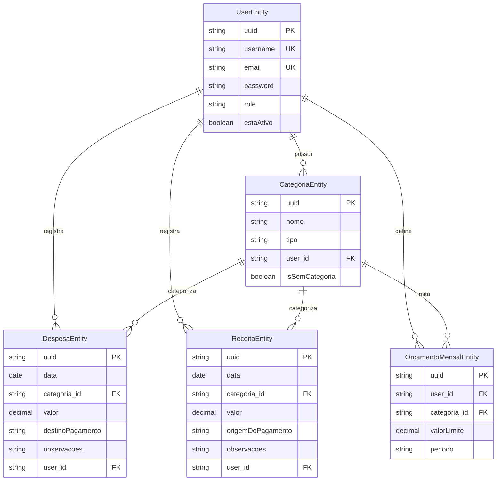

# API de Gestão Financeira

API REST desenvolvida em Spring Boot para gerenciamento de finanças pessoais, permitindo controle de receitas, despesas, categorias e orçamentos mensais.

## Autores

- Diego Rodrigues Figueiredo
- Gilberto de Brito Neto
- Luis Felipe de Oliveira Andrade

## Tecnologias

- Java 17
- Spring Boot 4.0.0
- Spring Security
- Spring Data JPA
- PostgreSQL
- JWT (JSON Web Token)
- Maven
- Docker e Docker Compose
- ModelMapper

## Funcionalidades

### Autenticação e Usuários
- Registro de novos usuários
- Login com autenticação JWT
- Gerenciamento de perfis de usuário
- Controle de acesso baseado em roles

### Receitas
- Criação, listagem, atualização e exclusão de receitas
- Busca por intervalo de datas
- Busca por intervalo de valores
- Geração de gráficos (pizza e barras)
- Categorização de receitas

### Despesas
- Criação, listagem, atualização e exclusão de despesas
- Busca por intervalo de datas
- Busca por intervalo de valores
- Geração de gráficos (pizza e barras)
- Categorização de despesas

### Categorias
- Criação e gerenciamento de categorias personalizadas
- Categorias padrão para receitas e despesas
- Separação por tipo (receitas/despesas)

### Orçamento Mensal
- Definição de limites de gastos por categoria
- Controle de orçamento por período
- Consulta de orçamentos por mês

### Dashboard
- Saldo total por período
- Total de receitas e despesas no mês
- Maior receita e maior despesa do período
- Categorias com maior receita e despesa

## Pré-requisitos

- Java 17 ou superior
- Maven 3.6 ou superior
- PostgreSQL 16 ou superior (ou Docker)
- Docker e Docker Compose (opcional, para execução via containers)

## Configuração

### Configuração Local

1. Clone o repositório:
```bash
git clone <url-do-repositorio>
cd gestao-financeira-prog-web-ufape-2025.2
```

2. Configure o banco de dados PostgreSQL:
   - Crie um banco de dados chamado `gestaofinanceiro_db`
   - Configure as credenciais no arquivo `GestaoFinanceiraApi/src/main/resources/application.properties`

3. Configure as variáveis de ambiente (opcional):
   - `JWT_SECRET`: Chave secreta para geração de tokens JWT (padrão: `development-secret-key`)

4. Execute a aplicação:
```bash
cd GestaoFinanceiraApi
./mvnw spring-boot:run
```

A aplicação estará disponível em `http://localhost:8090`

### Configuração com Docker

1. Navegue até o diretório da API:
```bash
cd GestaoFinanceiraApi
```

2. Execute o Docker Compose:
```bash
docker-compose up -d
```

Isso irá:
- Subir um container PostgreSQL na porta 5432
- Construir e executar a aplicação Spring Boot na porta 8080

3. Para parar os containers:
```bash
docker-compose down
```

4. Para remover os volumes (apaga os dados do banco):
```bash
docker-compose down -v
```

## Estrutura do Projeto

```
GestaoFinanceiraApi/
├── src/
│   ├── main/
│   │   ├── java/br/com/ufape/gestaofinanceiraapi/
│   │   │   ├── config/          # Configurações (CORS, Security, Mappers)
│   │   │   ├── controller/      # Controllers REST
│   │   │   ├── dto/             # Data Transfer Objects
│   │   │   ├── entities/        # Entidades JPA
│   │   │   ├── exceptions/      # Tratamento de exceções
│   │   │   ├── mappers/         # Mapeamento entre entidades e DTOs
│   │   │   ├── repositories/    # Repositórios JPA
│   │   │   ├── services/        # Lógica de negócio
│   │   │   └── utils/           # Utilitários
│   │   └── resources/
│   │       └── application.properties
│   └── test/                    # Testes unitários e de integração
├── docker-compose.yml
├── Dockerfile
└── pom.xml
```

## Modelo de Dados

O diagrama abaixo representa o modelo de entidades e relacionamentos do banco de dados:



## Endpoints Principais

### Autenticação
- `POST /auth/register` - Registro de novo usuário
- `POST /auth/login` - Login e obtenção de token JWT
- `GET /auth/{email}` - Buscar usuário por email

### Receitas
- `POST /receitas` - Criar receita
- `GET /receitas` - Listar todas as receitas do usuário
- `GET /receitas/{id}` - Buscar receita por ID
- `PUT /receitas/{id}` - Atualizar receita
- `DELETE /receitas/{id}` - Excluir receita
- `GET /receitas/grafico-pizza` - Gráfico pizza de receitas
- `GET /receitas/grafico-barras` - Gráfico barras de receitas
- `GET /receitas/por-intervalo-de-datas` - Buscar por intervalo de datas
- `GET /receitas/por-intervalo-de-valores` - Buscar por intervalo de valores

### Despesas
- `POST /despesas` - Criar despesa
- `GET /despesas` - Listar todas as despesas do usuário
- `GET /despesas/{id}` - Buscar despesa por ID
- `PUT /despesas/{id}` - Atualizar despesa
- `DELETE /despesas/{id}` - Excluir despesa
- `GET /despesas/grafico-pizza` - Gráfico pizza de despesas
- `GET /despesas/grafico-barras` - Gráfico barras de despesas
- `GET /despesas/por-intervalo-de-datas` - Buscar por intervalo de datas
- `GET /despesas/por-intervalo-de-valores` - Buscar por intervalo de valores

### Categorias
- `POST /categorias` - Criar categoria
- `GET /categorias` - Listar todas as categorias
- `GET /categorias/despesas` - Listar categorias de despesas
- `GET /categorias/receitas` - Listar categorias de receitas
- `PATCH /categorias/{id}` - Atualizar categoria
- `DELETE /categorias/{id}` - Excluir categoria

### Orçamento Mensal
- `POST /orcamento-mensal` - Criar orçamento mensal
- `GET /orcamento-mensal` - Listar todos os orçamentos
- `GET /orcamento-mensal/{uuid}` - Buscar orçamento por ID
- `GET /orcamento-mensal/periodo/{periodo}` - Buscar orçamentos por período
- `PUT /orcamento-mensal/{uuid}` - Atualizar orçamento
- `DELETE /orcamento-mensal/{uuid}` - Excluir orçamento

### Dashboard
- `GET /dashboard/saldo-total` - Saldo total do período
- `GET /dashboard/maior-despesa` - Maior despesa do período
- `GET /dashboard/maior-receita` - Maior receita do período
- `GET /dashboard/categoria-maior-despesa` - Categoria com maior despesa
- `GET /dashboard/categoria-maior-receita` - Categoria com maior receita
- `GET /dashboard/despesa-total` - Total de despesas no mês
- `GET /dashboard/receita-total` - Total de receitas no mês

## Autenticação

A API utiliza autenticação baseada em JWT. Para acessar os endpoints protegidos:

1. Faça login através do endpoint `/auth/login` com email e senha
2. Receba o token JWT na resposta
3. Inclua o token no header `Authorization` de todas as requisições:
```
Authorization: Bearer <seu-token-jwt>
```

## Configuração do Banco de Dados

O banco de dados é configurado automaticamente pelo Hibernate na primeira execução. O arquivo `application.properties` contém as configurações:

- URL: `jdbc:postgresql://localhost:5432/gestaofinanceiro_db`
- Usuário: `postgres`
- Senha: `admin`
- DDL Auto: `update` (mantém dados existentes)

Para produção, altere essas configurações no arquivo `application-prod.properties` ou através de variáveis de ambiente.

## Testes

Execute os testes com:
```bash
./mvnw test
```

Para gerar relatório de cobertura de testes:
```bash
./mvnw verify
```

O relatório será gerado em `target/site/jacoco/index.html`

## Build

Para gerar o JAR da aplicação:
```bash
./mvnw clean package
```

O arquivo JAR será gerado em `target/GestaoFinanceiraApi-0.0.1-SNAPSHOT.jar`

Para executar o JAR:
```bash
java -jar target/GestaoFinanceiraApi-0.0.1-SNAPSHOT.jar
```

## Perfis de Execução

A aplicação suporta diferentes perfis:

- `default`: Perfil de desenvolvimento (porta 8090)
- `prod`: Perfil de produção (porta 8080)
- `test`: Perfil de testes (usa H2 em memória)

Para executar com um perfil específico:
```bash
./mvnw spring-boot:run -Dspring-boot.run.profiles=prod
```

## Segurança

- Autenticação JWT implementada
- Senhas são criptografadas usando BCrypt
- Validação de tokens em todas as requisições protegidas
- Controle de acesso baseado em roles de usuário
- CORS configurado para permitir requisições de origens específicas

## Licença

Este projeto foi desenvolvido para fins acadêmicos no contexto da disciplina de Programação Web da UFAPE.
